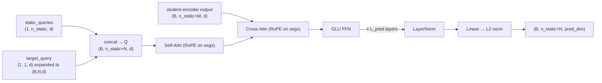
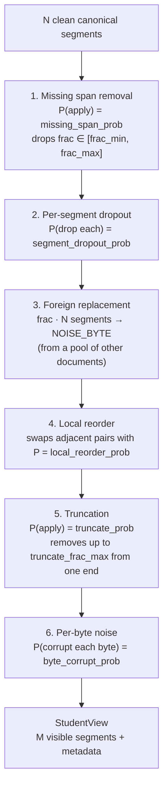

# JEPA Pretraining Reference

Byte-segment JEPA (Joint Embedding Predictive Architecture) pretraining for tokenizer-free document representations.  The approach encodes raw UTF-8 bytes in fixed-size canonical segments, trains a student encoder to predict teacher embeddings of masked / corrupted regions, and produces segment-level and document-level representations.

---

## Contents

1. [Quick Start](#quick-start)
2. [Data Format](#data-format)
3. [Architecture Overview](#architecture-overview)
4. [Inputs and Vocabulary](#inputs-and-vocabulary)
5. [Byte-Level Processing](#byte-level-processing)
6. [Segment Encoder](#segment-encoder)
7. [Position Encoding (RoPE)](#position-encoding-rope)
8. [Local / Global Attention](#local--global-attention)
9. [Static Tokens](#static-tokens)
10. [Teacher Encoder](#teacher-encoder)
11. [Segment Predictor](#segment-predictor)
12. [Loss Functions](#loss-functions)
13. [EMA Schedule](#ema-schedule)
14. [Corruption and Student View](#corruption-and-student-view)
15. [Curriculum Training](#curriculum-training)
16. [Weight Initialisation](#weight-initialisation)
17. [Monitoring Metrics](#monitoring-metrics)
18. [Configuration Reference](#configuration-reference)
19. [Example Configs](#example-configs)
20. [Extracting Embeddings](#extracting-embeddings)

---

## Quick Start

```bash
# Install (already included in the package)
pip install -e "."

# Run the full smoketest (tiny model, 10 steps, CPU)
python jepa_pretrain.py configs/jepa_smoketest.yaml

# Train with the light-2 configuration
python jepa_pretrain.py configs/jepa_light_2.yaml \
    data.train=/path/to/train.jsonl \
    data.val=/path/to/val.jsonl

# Override individual keys on the CLI
python jepa_pretrain.py configs/jepa_light_2.yaml \
    model.seg_dim=256 \
    training.batch_size=16 \
    optimizer.lr=3e-4
```

---

## Data Format

Training data must be in **JSONL** format.  Each line is a JSON object with two required fields:

| Field | Type | Description |
|-------|------|-------------|
| `id`   | str  | Unique document identifier |
| `text` | str  | Raw text; any Unicode, arbitrary length |

```jsonl
{"id": "doc-001", "text": "Lorem ipsum dolor sit amet..."}
{"id": "doc-002", "text": "Another document in raw form."}
```

Text is encoded as UTF-8 bytes and split into fixed-size **canonical segments** of `SEGMENT_SIZE = 16` bytes each.  Very long documents are truncated to `max_segments` segments (default 256).

---

## Architecture Overview

The full model data-flow is:

```mermaid
flowchart TB
    subgraph input["Input: raw UTF-8 document"]
        T[text]
    end

    T --> CS[text_to_canonical_segments\nN × 16 bytes]

    CS --> clean["Clean view\n(B, N, 16)"]
    CS --> corrupt["Corrupt → Student view\n(B, M, 16)  M ≤ N"]

    subgraph teacher_enc["Teacher encoder  (frozen / EMA)"]
        TE_emb[ByteInputEmbedding] --> TE_conv[LocalByteProcessor] --> TE_red[ByteToSegmentReducer]
        TE_static["[DOC] + static tokens prepend"]
        TE_red --> TE_static --> TE_tf[TransformerEncoder\n(pre-LN, RoPE, GLU)]
        TE_proj[teacher_target_proj\nLayerNorm → Linear]
    end

    subgraph student_enc["Student encoder  (learnable)"]
        SE_emb[ByteInputEmbedding] --> SE_conv[LocalByteProcessor] --> SE_red[ByteToSegmentReducer]
        SE_static["[DOC] + static tokens prepend"]
        SE_red --> SE_static --> SE_tf[TransformerEncoder\n(pre-LN, RoPE, GLU)]
    end

    subgraph pred["Segment Predictor"]
        P_sq["static_queries (learned)"]
        P_tq["target_query (learned)"]
        P_layers["_PredictorLayer × L_pred\n(self-attn + cross-attn + GLU)"]
        P_head["Linear head → L2 norm"]
    end

    clean --> teacher_enc
    corrupt --> student_enc

    TE_tf -- "layer outputs i∈T" --> TE_proj
    TE_proj -- "teacher_seg_targets\nteacher_doc_targets\n(stop-grad)" --> loss

    SE_tf -- "student context" --> P_layers
    P_sq --> P_layers
    P_tq --> P_layers
    P_layers --> P_head

    P_head -- "predicted_segments\npredicted_doc" --> loss

    loss["Loss\nL_seg + L_doc + L_var + L_cov"]
```

### Component summary

| Component | Class | Output shape |
|-----------|-------|-------------|
| Byte input embedding | `ByteInputEmbedding` | `(B, N, S, byte_dim)` |
| Local byte CNN | `LocalByteProcessor` | `(B, N, S, byte_dim)` |
| Segment reducer | `ByteToSegmentReducer` | `(B, N, seg_dim)` |
| Transformer encoder | `TransformerEncoderWithIntermediates` | `(B, n_static+N, seg_dim)` |
| Segment predictor | `SegmentPredictor` | `(B, n_static+N, pred_dim)` |
| Teacher projection | `teacher_target_proj` | `(B, n_static+N, pred_dim)` |

---

## Inputs and Vocabulary

### Byte vocabulary

The byte vocabulary has **259 tokens** (indices 0–258):

| Range | Meaning |
|-------|---------|
| 0–255 | Raw UTF-8 byte values |
| 256 (`PAD_BYTE`) | Zero-padding to fill the last segment |
| 257 (`MASK_BYTE`) | Masked / missing-span indicator |
| 258 (`NOISE_BYTE`) | Random noise byte (foreign replacement) |

### Corruption type vocabulary

Every byte position also carries a **corruption type** label (7 classes):

| Value | Name | Description |
|-------|------|-------------|
| 0 | `CLEAN` | Unmodified byte |
| 1 | `LIGHTLY_CORRUPTED` | A few bytes replaced |
| 2 | `HEAVILY_CORRUPTED` | Many bytes replaced |
| 3 | `REPLACED` | Entire segment replaced with foreign content |
| 4 | `INSERTED` | Distractor segment inserted (no clean target) |
| 5 | `MISSING` | Segment absent from student sequence |
| 6 | `PADDING` | Zero-pad segment beyond document end |

### Batch tensors

| Tensor | Shape | Description |
|--------|-------|-------------|
| `clean_byte_values` | `(B, N, S)` | Clean canonical byte values (long) |
| `clean_byte_types` | `(B, N, S)` | Clean corruption-type labels (long) |
| `canonical_positions` | `(B, N)` | Integer position index per canonical segment |
| `canonical_mask` | `(B, N)` | Bool: `True` = valid segment |
| `student_bytes` | `(B, M, S)` | Corrupted student byte values |
| `student_byte_types` | `(B, M, S)` | Per-byte corruption-type labels |
| `student_positions` | `(B, M)` | Original canonical positions of student segments |
| `student_mask` | `(B, M)` | Bool: `True` = valid student segment |
| `segment_loss_weights` | `(B, N)` | Per-segment loss weight (float, depends on corruption type) |

Here $S = 16$ (`SEGMENT_SIZE`), $N$ is the number of canonical segments, and $M \le N$ is the number of visible student segments.

---

## Byte-Level Processing

### ByteInputEmbedding

Three learned tables are summed and then layer-normalised:

$$\mathbf{e}_{b,i} = \text{LayerNorm}\bigl(\text{Emb}_\text{val}[v_{b,i}] + \text{Emb}_\text{off}[i \bmod S] + \text{Emb}_\text{type}[t_{b,i}]\bigr)$$

where $v_{b,i}$ is the byte value, $i \bmod S$ is the intra-segment offset (0–15), and $t_{b,i}$ is the corruption-type label.

All three embedding tables have dimension `byte_dim`.

### LocalByteProcessor

`n_byte_blocks` residual `ByteConvBlock` layers are applied **independently within each segment** (the $B \times N$ segments are processed as a flat batch):

$$\mathbf{h} = \mathbf{x} + \text{Dropout}(\text{Conv1d}(\text{LN}(\mathbf{x})))$$
$$\mathbf{h}' = \mathbf{h} + \text{GLU}(\text{LN}(\mathbf{h}))$$

The Conv1d has kernel size `kernel_size` (default 5) with `same` padding.

### ByteToSegmentReducer

Four pooling views of the $S=16$ byte representations are concatenated and projected to `seg_dim`:

$$\mathbf{s} = \text{LN}\bigl(\mathbf{W}_\text{red} \cdot [\bar{\mathbf{h}} \,\|\, \hat{\mathbf{h}} \,\|\, \mathbf{h}_0 \,\|\, \mathbf{h}_{S-1}]\bigr)$$

- $\bar{\mathbf{h}}$: mean pool over all $S$ bytes
- $\hat{\mathbf{h}}$: learned attention pool ($\text{softmax}(\mathbf{w} \cdot \mathbf{h})$, scalar query)
- $\mathbf{h}_0, \mathbf{h}_{S-1}$: first and last byte representations

The result is a single segment vector in $\mathbb{R}^{\text{seg\_dim}}$.

---

## Segment Encoder

`TransformerEncoderWithIntermediates` is a pre-layer-norm Transformer with `n_encoder_layers` layers.  Each layer (`_TransformerLayer`) computes:

$$\mathbf{x} \leftarrow \mathbf{x} + \text{Dropout}(\text{SelfAttn}(\text{LN}(\mathbf{x})))$$
$$\mathbf{x} \leftarrow \mathbf{x} + \text{GLU}(\text{LN}(\mathbf{x}))$$

**No biases** on query, key, value, or output projections (ModernBERT style).

### GLU Feed-Forward

The 2-layer gated feed-forward uses either **SwiGLU** (default) or **GeGLU**:

$$\text{SwiGLU}(\mathbf{x}) = \mathbf{W}_2 \,[\text{SiLU}(\mathbf{g}) \odot \mathbf{v}], \quad [\mathbf{g}, \mathbf{v}] = \mathbf{W}_1 \mathbf{x}$$

$$\text{GeGLU}(\mathbf{x}) = \mathbf{W}_2 \,[\text{GELU}(\mathbf{g}) \odot \mathbf{v}], \quad [\mathbf{g}, \mathbf{v}] = \mathbf{W}_1 \mathbf{x}$$

$\mathbf{W}_1 \in \mathbb{R}^{2 \cdot \text{ffn\_dim} \times \text{seg\_dim}}$, $\mathbf{W}_2 \in \mathbb{R}^{\text{seg\_dim} \times \text{ffn\_dim}}$, no biases on $\mathbf{W}_1$.  
The split point is a **concrete integer** (`ffn_dim`) so `torch.compile` can trace without symbolic shape ambiguity.

### Attention

Standard multi-head scaled dot-product attention via `F.scaled_dot_product_attention` (Flash Attention when available):

$$\text{Attn}(Q, K, V) = \text{softmax}\!\left(\frac{QK^\top}{\sqrt{d_\text{head}}} + B\right) V$$

where $B$ is an optional additive bias (float $-\infty$ for masked positions).  RoPE is applied to $Q$ and $K$ before the dot product.  See [Position Encoding](#position-encoding-rope).

---

## Position Encoding (RoPE)

**Rotary Position Embedding** is applied to the *segment* portion of the sequence (indices $\ge n\_\text{static}$).  Static tokens ([DOC] etc.) receive no positional encoding.

For a query / key vector $\mathbf{x} \in \mathbb{R}^{d_\text{head}}$ at position $p$:

$$\text{RoPE}(\mathbf{x}, p)_i = x_i \cos(p \theta_i) - x_{i+d/2} \sin(p \theta_i)$$
$$\text{RoPE}(\mathbf{x}, p)_{i+d/2} = x_{i+d/2} \cos(p \theta_i) + x_i \sin(p \theta_i)$$

with $\theta_i = 10000^{-2i/d_\text{head}}$, $i = 0, \ldots, d_\text{head}/2 - 1$.

A single `RotaryEmbedding` table is **shared** between the encoder and the predictor.  It stores precomputed $\cos$ and $\sin$ buffers of shape `(max_seq_len, head_dim)`.

**In the predictor**, the canonical positions of the *target query tokens* are used as $Q$ positions, and the canonical positions of the *visible student segments* are used as $K$ positions.  This means a student segment at original position $p$ attends to a target query also at position $p$, giving the predictor precise spatial information about what to reconstruct.

---

## Local / Global Attention

Each layer is independently classified as **local** or **global**:

- Layer $i$ (0-indexed) is **local** when `local_window_size > 0` AND $(i+1) \bmod \text{global\_attention\_every\_n} \ne 0$.
- Setting `local_window_size = 0` makes all layers global (default, full $O(N^2)$ attention).

For local layers a sliding-window boolean attention mask is constructed on-the-fly:

$$M_{qk} = \begin{cases} \text{True} & |q - k| \le \text{local\_window\_size} \\ \text{True} & q < n_\text{static} \text{ (static row)} \\ \text{True} & k < n_\text{static} \text{ (static column)} \\ \text{False} & \text{otherwise} \end{cases}$$

Static tokens always attend to and from all positions, regardless of the window setting.

---

## Static Tokens

The sequence fed to the encoder prepends `n_static = 1 + n_additional_tokens` learned embeddings before the segment vectors:

```
[  DOC  ]  [ extra_0 ]  …  [ extra_k ]  [ seg_0 ]  [ seg_1 ]  …  [ seg_{N-1} ]
 ←————————————— n_static —————————————→  ←—————— N canonical segments ——————→
```

- `doc_embed`: a single learned parameter $\in \mathbb{R}^{1 \times 1 \times \text{seg\_dim}}$.
- `additional_token_embeds`: $n\_\text{additional} \times \text{seg\_dim}$ learned parameters (only present when `n_additional_tokens > 0`).

Static tokens carry **no positional encoding** — they are position-invariant by design.

The predictor predicts all static tokens in addition to the canonical segments via separate **learned query embeddings** (`static_queries`, shape $1 \times n\_\text{static} \times \text{seg\_dim}$).

---

## Teacher Encoder

The teacher shares the same `ByteSegmentEncoder` architecture as the student.  Its weights are never updated by gradient descent.

Two modes are available (`teacher_mode`):

| Mode | Behaviour |
|------|-----------|
| `"ema"` (default) | Teacher is an exponential moving average of the student; updated after every training step |
| `"frozen"` | Teacher is initialised from the same checkpoint as the student and kept fixed for the entire run |

**Teacher targets** are computed from the teacher's intermediate layer outputs.  Layers `teacher_target_layers` (default: last 25% of encoder layers) are averaged:

$$\mathbf{z}^{(l)} = \text{output of teacher layer } l$$
$$\bar{\mathbf{z}} = \frac{1}{|\mathcal{T}|} \sum_{l \in \mathcal{T}} \mathbf{z}^{(l)}$$

Then projected and L2-normalised:

$$\mathbf{z}_\text{target} = \text{L2Norm}\bigl(\text{Linear}(\text{LN}(\bar{\mathbf{z}}))\bigr) \in \mathbb{R}^{\text{pred\_dim}}$$

Segment targets (shape `(B, N, pred_dim)`) and static-token targets (shape `(B, n_static, pred_dim)`) are extracted from the first `n_static` and remaining positions respectively.

---

## Segment Predictor

The predictor is a cross-attention decoder (`SegmentPredictor`).  Given the student context, it predicts the teacher targets at all canonical positions (including static tokens).



Each `_PredictorLayer` applies pre-LN self-attention, pre-LN cross-attention, and then a pre-LN GLU block:

$$\mathbf{q} \leftarrow \mathbf{q} + \text{Dropout}(\text{SelfAttn}(\text{LN}(\mathbf{q})))$$
$$\mathbf{q} \leftarrow \mathbf{q} + \text{Dropout}(\text{CrossAttn}(\text{LN}(\mathbf{q}),\, \text{student context}))$$
$$\mathbf{q} \leftarrow \mathbf{q} + \text{GLU}(\text{LN}(\mathbf{q}))$$

RoPE is applied to the **segment portion** of both $Q$ (target queries) and $K$ (student context) using the canonical positions.  Static query positions receive no RoPE.

The output is L2-normalised per position:

$$\hat{\mathbf{p}}_i = \text{L2Norm}(\text{Linear}(\text{LN}(\mathbf{q}_i)))$$

---

## Loss Functions

The total loss is a weighted sum of four terms:

$$\mathcal{L} = w_\text{seg} \mathcal{L}_\text{seg} + w_\text{doc} \mathcal{L}_\text{doc} + w_\text{var} \mathcal{L}_\text{var} + w_\text{cov} \mathcal{L}_\text{cov}$$

Default weights: $w_\text{seg}=1.0$, $w_\text{doc}=0.2$, $w_\text{var}=0.05$, $w_\text{cov}=0.01$.

### Segment JEPA loss $\mathcal{L}_\text{seg}$

Weighted mean cosine loss over valid canonical segments:

$$\mathcal{L}_\text{seg} = \frac{\sum_{b,i} w_{b,i} \cdot m_{b,i} \cdot \bigl(1 - \hat{\mathbf{p}}_{b,i} \cdot \text{stopgrad}(\mathbf{z}_{b,i})\bigr)}{\sum_{b,i} w_{b,i} \cdot m_{b,i}}$$

where $w_{b,i}$ is the per-segment loss weight (from `SEGMENT_LOSS_WEIGHTS`, see table below) and $m_{b,i}$ is the canonical mask.

| Segment type | Loss weight |
|-------------|-------------|
| `MISSING` | 1.00 |
| `REPLACED` | 1.00 |
| `HEAVILY_CORRUPTED` | 0.70 |
| `LIGHTLY_CORRUPTED` | 0.40 |
| `CLEAN` | 0.15 |
| `INSERTED` | 0.00 |
| `PADDING` | 0.00 |

### Document consistency loss $\mathcal{L}_\text{doc}$

Cosine loss between the predicted and teacher [DOC] tokens:

$$\mathcal{L}_\text{doc} = \frac{1}{B} \sum_b \bigl(1 - \hat{\mathbf{p}}_{b,\text{doc}} \cdot \text{stopgrad}(\mathbf{z}_{b,\text{doc}})\bigr)$$

### Variance regularisation $\mathcal{L}_\text{var}$ (VICReg)

Prevents dimensional collapse by penalising low per-dimension variance across the batch:

$$\mathcal{L}_\text{var} = \frac{1}{|\mathcal{E}|} \sum_{e \in \mathcal{E}} \frac{1}{D} \sum_{j=1}^{D} \max\bigl(0,\, \gamma - \text{std}_j(e)\bigr), \quad \gamma = 0.1$$

Applied to both `predicted_segments` (flattened to `(B·N, pred_dim)`) and `predicted_doc` (`(B, pred_dim)`).

### Covariance regularisation $\mathcal{L}_\text{cov}$ (VICReg)

Reduces off-diagonal covariance (anisotropy):

$$\mathcal{L}_\text{cov} = \frac{1}{|\mathcal{E}|} \sum_{e \in \mathcal{E}} \frac{1}{D} \sum_{i \ne j} \bigl[\text{Cov}(e)\bigr]^2_{ij}$$

---

## EMA Schedule

The teacher momentum follows a **cosine annealing** schedule from `momentum_start` to `momentum_end`:

$$m(t) = m_\text{end} - (m_\text{end} - m_\text{start}) \cdot \frac{1 + \cos(\pi \cdot t / T)}{2}$$

where $t$ is the current training step and $T$ is `max_steps`.  Typical value: $m_\text{start} = 0.999$, $m_\text{end} = 0.9999$.

After each batch the teacher is updated:

$$\theta_\text{teacher} \leftarrow m \cdot \theta_\text{teacher} + (1 - m) \cdot \theta_\text{student}$$

When `teacher_mode = "frozen"` this update is skipped entirely.

---

## Corruption and Student View

The student view is generated by `generate_student_view()` which applies the following corruption pipeline in order:



Corruption parameters per canonical segment determine its `segment_loss_weight` (see [Loss Functions](#loss-functions)).  Segments not visible in the student view receive the highest weight (`MISSING = 1.0`).

---

## Curriculum Training

Training progresses through 5 stages.  The `CurriculumScheduler` advances when validation loss fails to improve for `patience` consecutive evaluations.

| Stage | Min chars | Max chars | Notes |
|-------|-----------|-----------|-------|
| `sanity` | 500 | 1 000 | Very short documents; gentle corruption |
| `short` | 500 | 2 000 | Short documents |
| `medium` | 1 000 | 5 000 | Medium length |
| `long` | 3 000 | 10 000 | Long documents |
| `full` | 500 | 10 000 | All lengths (default final stage) |

Each stage also has its own `CorruptionConfig` (probabilities increase with stage).

---

## Weight Initialisation

When `megatron_init = true` (default), weights are initialised following Megatron-Core conventions:

| Parameter type | Init |
|----------------|------|
| Embeddings (`doc_embed`, `additional_token_embeds`, `static_queries`, `target_query`, `nn.Embedding`) | $\mathcal{N}(0,\, 0.02)$ |
| Most linear weights | $\mathcal{N}(0,\, 0.02)$ |
| Linear weights tagged `_is_residual_output` (attention out-proj, GLU $W_2$) | $\mathcal{N}\!\left(0,\, \dfrac{0.02}{\sqrt{2 \cdot L}}\right)$ where $L$ is the layer count for that sub-network |
| All biases | 0 |
| `LayerNorm` weight | 1 |
| `LayerNorm` bias | 0 |

---

## Monitoring Metrics

The following metrics are logged at each validation step:

| Metric | Description |
|--------|-------------|
| `val/<name>/loss` | Total weighted loss |
| `val/<name>/loss_seg` | Segment JEPA cosine loss |
| `val/<name>/loss_doc` | Document consistency loss |
| `val/<name>/loss_var` | Variance regularisation |
| `val/<name>/loss_cov` | Covariance regularisation |
| `val/<name>/cosine_seg` | Mean cosine similarity, student predictions vs teacher segment targets |
| `val/<name>/cosine_doc` | Cosine similarity, student doc prediction vs teacher doc target |
| `val/<name>/embedding_std` | Mean per-dimension std of predicted segment embeddings (collapse monitor; should stay > 0.1) |

Training steps also log:

| Metric | Description |
|--------|-------------|
| `train/loss` | Per-step total loss |
| `train/loss_seg/doc/var/cov` | Individual loss components |
| `train/ema_momentum` | Current EMA momentum value |
| `train/encoder_grad_norm` | Student encoder gradient L2 norm |
| `train/predictor_grad_norm` | Predictor gradient L2 norm |

---

## Configuration Reference

Config files use [OmegaConf](https://omegaconf.readthedocs.io/) YAML with `_base_` inheritance (see `docs/configuration.md`).

### `model`

| Key | Type | Default | Description |
|-----|------|---------|-------------|
| `byte_dim` | int | `256` | Byte embedding and local CNN dimension |
| `seg_dim` | int | `512` | Segment-level transformer $d_\text{model}$ |
| `pred_dim` | int | `512` | Predictor output / teacher target dimension |
| `n_byte_blocks` | int | `4` | Number of `ByteConvBlock` residual layers |
| `n_encoder_layers` | int | `12` | Transformer encoder layers |
| `n_heads` | int | `8` | Attention heads |
| `ffn_dim` | int | `2048` | GLU hidden dimension (each of gate and value) |
| `n_predictor_layers` | int | `4` | Predictor cross-attention layers |
| `kernel_size` | int | `5` | Local byte Conv1D kernel size |
| `dropout` | float | `0.1` | Encoder/predictor dropout |
| `byte_dropout` | float | `0.05` | Local byte processor dropout |
| `ema_momentum` | float | `0.996` | Starting EMA momentum |
| `teacher_target_layers` | list\|null | `null` | Encoder layer indices averaged for teacher targets; `null` = last 25% of layers |
| `n_additional_tokens` | int | `0` | Extra static tokens prepended alongside `[DOC]` |
| `local_window_size` | int | `0` | Sliding-window attention radius (tokens). `0` = global attention for all layers |
| `global_attention_every_n` | int | `1` | Every *n*-th encoder layer uses full global attention; others use local window. Ignored when `local_window_size=0` |
| `activation` | str | `"swiglu"` | FFN gate: `"swiglu"` (SiLU) or `"geglu"` (GELU) |
| `teacher_mode` | str | `"ema"` | `"ema"` (EMA-updated) or `"frozen"` (fixed) |
| `megatron_init` | bool | `true` | Apply Megatron-Core weight initialisation |
| `extend_from_checkpoint` | str\|null | `null` | Path to a smaller checkpoint to extend layers from |
| `compile` | bool | `false` | Wrap model with `torch.compile` |

### `ema`

| Key | Type | Default | Description |
|-----|------|---------|-------------|
| `momentum_start` | float | `0.999` | EMA momentum at step 0 |
| `momentum_end` | float | `0.9999` | EMA momentum at final step (cosine schedule) |

### `loss`

| Key | Type | Default | Description |
|-----|------|---------|-------------|
| `segment` | float | `1.0` | $w_\text{seg}$ |
| `document` | float | `0.2` | $w_\text{doc}$ |
| `variance` | float | `0.05` | $w_\text{var}$ |
| `covariance` | float | `0.01` | $w_\text{cov}$ |

### `data`

| Key | Type | Default | Description |
|-----|------|---------|-------------|
| `train` | str | — | Path to training JSONL (**required**) |
| `val` | str\|list | — | Validation JSONL(s); each entry has `path` and `name` |
| `max_segments` | int | `256` | Maximum canonical segments per document |
| `num_workers` | int | `4` | DataLoader workers |

### `corruption`

| Key | Type | Default | Description |
|-----|------|---------|-------------|
| `missing_span_prob` | float | `0.30` | Probability of applying a missing span |
| `missing_span_frac_min` | float | `0.05` | Minimum removed fraction per span |
| `missing_span_frac_max` | float | `0.25` | Maximum removed fraction per span |
| `segment_dropout_prob` | float | `0.05` | Per-segment dropout probability |
| `foreign_replace_frac` | float | `0.05` | Fraction of segments replaced by foreign bytes |
| `local_reorder_prob` | float | `0.0` | Fraction of adjacent segment pairs swapped |
| `truncate_prob` | float | `0.1` | Probability of truncation |
| `truncate_frac_max` | float | `0.2` | Maximum fraction to truncate |
| `byte_corrupt_prob` | float | `0.05` | Per-byte corruption probability |
| `byte_heavy_frac` | float | `0.10` | Fraction threshold for `HEAVILY_CORRUPTED` label |

### `training`

| Key | Type | Default | Description |
|-----|------|---------|-------------|
| `batch_size` | int | `32` | Documents per step |
| `val_batch_size` | int | `32` | Validation batch size |
| `max_steps` | int | `500000` | Total optimiser steps |
| `val_every_n_steps` | int | `5000` | Validate every N steps |
| `grad_accumulation` | int | `4` | Gradient accumulation steps |
| `gradient_clip_val` | float | `1.0` | Max gradient norm |
| `precision` | str | `"bf16-mixed"` | Trainer precision string |
| `devices` | str\|int | `"auto"` | Number of GPUs |
| `strategy` | str | `"auto"` | Lightning distributed strategy |

### `optimizer`

AdamW is used.

| Key | Type | Default | Description |
|-----|------|---------|-------------|
| `lr` | float | `1e-4` | Peak learning rate |
| `weight_decay` | float | `0.01` | AdamW weight decay (not applied to bias/LN) |
| `betas` | list | `[0.9, 0.999]` | Adam $\beta_1, \beta_2$ |
| `eps` | float | `1e-8` | Adam $\epsilon$ |

### `scheduler`

| Key | Type | Default | Description |
|-----|------|---------|-------------|
| `name` | str | `"linear_warmup_cosine"` | Schedule type; also `"constant_warmup"`, `"cosine"`, `"constant"` |
| `warmup_steps` | int | `1000` | Linear warmup steps |
| `total_steps` | int | `500000` | Total steps (for cosine decay) |

### `checkpoint`

| Key | Type | Default | Description |
|-----|------|---------|-------------|
| `enabled` | bool | `true` | Save checkpoints |
| `dirpath` | str | `"checkpoints/jepa"` | Checkpoint directory |
| `save_top_k` | int | `20` | Number of top checkpoints to keep |
| `save_last` | bool | `true` | Always save the last checkpoint |
| `mode` | str | `"min"` | `"min"` or `"max"` for monitored metric |

---

## Example Configs

Available configs (all in `configs/`):

| File | Description |
|------|-------------|
| `jepa_smoketest.yaml` | Tiny model (2 layers, seg_dim=64), 10 steps on CPU for CI |
| `jepa_light_2.yaml` | 6-layer encoder, seg_dim=512; primary development config |
| `jepa_light_2_local.yaml` | Local/global: `local_window_size=64`, `global_attention_every_n=3` |
| `jepa_light_2_geglu.yaml` | GeGLU activation ablation (otherwise identical to light_2) |
| `jepa_light_2_staged_8l.yaml` | 8-layer extension from a 6-layer `jepa_light_2` checkpoint |
| `jepa_base.yaml` | 12-layer full base config |

**Local/global attention (ModernBERT-style):**
```yaml
_base_: jepa_light_2.yaml
model:
  local_window_size: 64         # ±64 segment window
  global_attention_every_n: 3   # global at layers 3, 6
```

**GeGLU activation:**
```yaml
_base_: jepa_light_2.yaml
model:
  activation: "geglu"
```

**Additional static tokens:**
```yaml
model:
  n_additional_tokens: 4        # [DOC] + 4 extra = 5 static tokens total
```

**Frozen teacher (transfer / ablation):**
```yaml
model:
  teacher_mode: "frozen"
```

**Gradual depth extension (6 → 8 layers):**
```yaml
_base_: jepa_light_2.yaml
model:
  n_encoder_layers: 8
  extend_from_checkpoint: "checkpoints/jepa/last.ckpt"
scheduler:
  warmup_steps: 500             # shorter warmup since most weights are pretrained
```

---

## Extracting Embeddings

After pretraining, load the student encoder and call it directly for inference:

```python
import torch
from omegaconf import OmegaConf
from text_classification.jepa.model import ByteSegmentJEPA
from text_classification.jepa.corruption import (
    text_to_canonical_segments, CorruptionType, SEGMENT_SIZE
)

# Load checkpoint
ckpt = torch.load("checkpoints/jepa/last.ckpt", map_location="cpu")
cfg = OmegaConf.load("configs/jepa_light_2.yaml")

model = ByteSegmentJEPA(**cfg.model)
# strip Lightning "model." prefix
state = {k.removeprefix("model."): v
         for k, v in ckpt["state_dict"].items()
         if k.startswith("model.")}
model.load_state_dict(state)
model.eval()

# Encode a document
text = "Prague is the capital of the Czech Republic."
segments = text_to_canonical_segments(text)
N = len(segments)

clean_bytes = torch.zeros(1, N, SEGMENT_SIZE, dtype=torch.long)
clean_types = torch.zeros(1, N, SEGMENT_SIZE, dtype=torch.long)  # all CLEAN
for i, seg in enumerate(segments):
    for j, b in enumerate(seg):
        clean_bytes[0, i, j] = b

canonical_positions = torch.arange(N).unsqueeze(0)   # (1, N)
canonical_mask      = torch.ones(1, N, dtype=torch.bool)

with torch.no_grad():
    out = model(
        clean_byte_values=clean_bytes,
        clean_byte_types=clean_types,
        canonical_positions=canonical_positions,
        canonical_mask=canonical_mask,
        student_bytes=clean_bytes,       # no corruption for inference
        student_byte_types=clean_types,
        student_positions=canonical_positions,
        student_mask=canonical_mask,
    )

# Shape: (1, pred_dim) — document-level embedding (most stable)
doc_embedding  = out["teacher_doc_targets"]

# Shape: (1, N, pred_dim) — per-segment embeddings
seg_embeddings = out["teacher_seg_targets"]
```

> **Tip:** Use `teacher_doc_targets` / `teacher_seg_targets` (teacher outputs) rather than the predicted variants for downstream tasks — the teacher produces more stable embeddings due to EMA smoothing.

