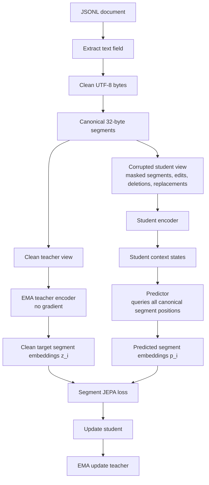

# Byte Segment JEPA: pretraining-only implementation blueprint


## 1. Goal

Train a tokenizer-free encoder that maps raw UTF-8 text into robust segment-level and document-level representations using **JEPA-style latent prediction**.

The model learns by predicting clean latent embeddings of text segments from a corrupted or incomplete view of the same text.

```text
clean text → teacher encoder → target segment embeddings
corrupted / incomplete text → student encoder + predictor → predicted segment embeddings
```

Only the pretraining system is covered here. Fine-tuning and downstream use are intentionally excluded.

---

# 2. High-level training structure



The predictor is trained to predict the teacher’s clean latent representation for every original segment position, especially those that are missing or corrupted in the student view.

---

# 3. Dataset format

Each JSONL row should contain one document.

```json
{
  "id": "doc_001",
  "text": "...",
  "source": "optional",
  "language": "optional",
  "quality": "optional",
  "metadata": {}
}
```

Required fields:

```text
id
text
```

Recommended dataset handling:

```text
1. Split train / validation / test by document ID.
2. Remove empty and extremely short documents.
3. Deduplicate near-identical documents before splitting.
4. Preserve punctuation, casing, whitespace, emojis, markup, and formatting.
5. Avoid aggressive normalization.
6. Optionally store source, language, and quality metadata for sampling and diagnostics.
```

---

# 4. Text-to-byte representation

Convert text to raw UTF-8 bytes.

```text
text → UTF-8 byte sequence
```

Byte vocabulary:

```text
0-255   raw byte values
256     PAD_BYTE
257     MASK_BYTE
258     OPTIONAL_NOISE_BYTE
```

Use bytes directly. No tokenizer, no wordpiece vocabulary, no BPE, no character vocabulary.

---

# 5. Canonical segmentation

Before corruption, split the clean byte stream into fixed-size canonical segments.

```text
segment_size = 32 bytes
```

Example:

```text
bytes 1-32      → segment 1
bytes 33-64     → segment 2
bytes 65-96     → segment 3
...
```

Recommended initial limits:

```text
segment_size: 32 bytes
max_segments: 2048
max_bytes: 65,536
```

Important invariant:

```text
segment index i always refers to the i-th clean segment.
```

This is essential because the student view may contain missing, reordered, inserted, or replaced content, but the prediction target remains the clean segment embedding at the original canonical position.

---

# 6. Model components

## 6.1 Byte input layer

Each byte receives:

```text
byte value embedding
+ byte offset embedding inside segment
+ corruption-type embedding
```

Recommended dimensions:

```text
byte_embedding_dim = 256
segment_model_dim = 512
prediction_dim = 512
```

Byte offset embedding:

```text
offset 0-31 within each 32-byte segment
```

Corruption-type embedding labels:

```text
clean
lightly_corrupted
heavily_corrupted
replaced
inserted
missing
padding
```

Missing segments do not pass byte content into the student encoder, but their positions are still queried by the predictor.

---

## 6.2 Local byte processor

Purpose:

```text
Capture local spelling, punctuation, casing, emojis, whitespace, byte patterns, and short-range formatting.
```

Recommended first version:

```text
4 residual Conv1D/SwiGLU blocks
hidden size: 256
kernel size: 5 or 7
normalization: pre-layernorm
dropout: 0.05-0.10
```

Generic block:

```text
x = x + Conv1D(LayerNorm(x))
x = x + SwiGLU_MLP(LayerNorm(x))
```

This processor operates before segment reduction.

---

## 6.3 Byte-to-segment reducer

Reduce each 32-byte segment to one segment vector.

Recommended reducer:

```text
mean pooling over byte states
+ attention pooling over byte states
+ first byte state
+ last byte state
→ linear projection
```

Output:

```text
segment_vector_i ∈ R^512
```

For clean teacher input:

```text
all canonical segments are present
```

For corrupted student input:

```text
some segment vectors are clean
some are corrupted
some are replaced by foreign content
some are absent
```

---

## 6.4 Student encoder

The student encoder receives the corrupted or incomplete segment sequence.

Recommended architecture:

```text
12-layer Transformer encoder
d_model = 512
attention heads = 8
FFN size = 2048
activation = SwiGLU or GELU
normalization = pre-layernorm
dropout = 0.1
attention dropout = 0.1
```

Input:

```text
[DOC] + visible / corrupted / replaced segment vectors
```

Position encoding:

```text
RoPE over canonical segment indices
```

Use the original clean segment index as the position ID.

Example:

```text
clean positions:      1 2 3 4 5 6 7 8
missing positions:        3 4
student sequence:     1 2 5 6 7 8
student position IDs: 1 2 5 6 7 8
```

This prevents deletions from being interpreted as simple shortening.

---

## 6.5 EMA teacher encoder

The teacher is an exponential-moving-average copy of the student encoder.

Teacher input:

```text
clean, uncorrupted canonical segments
```

Teacher output:

```text
clean contextual segment embeddings z_i
```

Teacher update:

```text
teacher ← m * teacher + (1 - m) * student
```

Recommended momentum schedule:

```text
start: 0.996
end:   0.9999
```

The teacher is not updated by gradient descent.

Target embeddings:

```text
z_i = projection(LayerNorm(average of upper teacher layers at segment i))
z_i = L2Normalize(z_i)
```

Recommended first target:

```text
average of teacher layers 9-12
```

Using multiple upper layers usually gives more stable targets than using only the final layer.

---

## 6.6 Segment predictor

The predictor predicts the teacher’s clean embedding for every canonical segment position.

Inputs:

```text
student encoder context states
target queries for all canonical segment positions
```

Target query for segment `i`:

```text
q_i =
    learned target-query embedding
  + positional encoding for canonical segment index i
  + optional length-bucket embedding
```

Recommended predictor:

```text
4-layer Transformer decoder / cross-attention predictor
d_model = 512
attention heads = 8
FFN size = 2048
dropout = 0.1
```

Output:

```text
p_i = prediction_head(predictor_state_i)
p_i = L2Normalize(p_i)
```

The predictor produces:

```text
p_1, p_2, ..., p_N
```

where `N` is the number of canonical clean segments.

---

# 7. Student-view corruption

Corruptions are applied only to the student view.

The teacher always receives the clean canonical byte segments.

Each example should produce:

```text
clean_segments
student_segments
canonical_position_ids
corruption_labels
segment_loss_weights
```

---

## 7.1 Segment-level corruptions

Use these as the main corruption types.

| Corruption          | Description                                                   |
| ------------------- | ------------------------------------------------------------- |
| Missing span        | Remove contiguous segment ranges from the student input       |
| Segment dropout     | Remove isolated individual segments                           |
| Foreign replacement | Replace a clean segment with bytes from another document      |
| Local reorder       | Swap nearby segments while preserving original position IDs   |
| Duplicate segment   | Repeat a nearby or foreign segment as distractor content      |
| Truncation          | Remove prefix, suffix, or middle region from the student view |

---

## 7.2 Byte/character-level corruptions

Apply within retained segments.

| Corruption              | Description                                                                 |
| ----------------------- | --------------------------------------------------------------------------- |
| Character deletion      | Delete random characters before byte encoding                               |
| Character insertion     | Insert punctuation, whitespace, random characters, or short snippets        |
| Character substitution  | Replace characters with keyboard-near, Unicode-near, or random alternatives |
| Local character reorder | Swap adjacent characters or short character spans                           |
| Byte deletion           | Remove random bytes                                                         |
| Byte replacement        | Replace bytes with random byte values                                       |
| Whitespace noise        | Add, remove, or repeat spaces, tabs, and newlines                           |
| Formatting noise        | Inject markdown, HTML-like fragments, bullets, quotes, or separators        |

For the first version, prefer text-level corruption before UTF-8 encoding. Add invalid byte-level corruption only if malformed text robustness is a goal.

---

## 7.3 Foreign text replacement

Foreign replacement is especially useful for JEPA pretraining.

Procedure:

```text
1. Select segment i in the clean document.
2. Sample a short byte span from a different document.
3. Place the foreign content at canonical position i in the student view.
4. Keep the target as the clean teacher embedding z_i.
```

Effect:

```text
student input at position i: foreign/noisy content
target at position i: clean original latent representation
```

This trains the predictor to use surrounding context and not simply copy visible bytes.

---

# 8. Loss functions

## 8.1 Segment JEPA loss

Primary loss:

```text
L_seg = weighted mean_i [1 - cosine(p_i, stopgrad(z_i))]
```

Where:

```text
p_i = predicted embedding for segment i
z_i = teacher target embedding for clean segment i
```

All segment targets are predicted, but loss weights differ by corruption type.

Recommended weights:

| Segment type                                  |  Weight |
| --------------------------------------------- | ------: |
| Missing segment                               |     1.0 |
| Foreign-replaced segment                      |     1.0 |
| Heavily corrupted visible segment             |     0.7 |
| Lightly corrupted visible segment             |     0.4 |
| Clean visible segment                         | 0.1-0.2 |
| Pure inserted distractor with no clean target |     0.0 |
| Padding                                       |     0.0 |

This prevents training from being dominated by easy visible clean segments.

---

## 8.2 Document-level JEPA consistency loss

Compute a document representation from the student and teacher encoders.

Student document representation:

```text
s_doc = pooled student representation
```

Teacher document representation:

```text
z_doc = pooled clean teacher representation
```

Pooling:

```text
[DOC] state
+ masked mean over segment states
+ optional attention pooling
→ projection
→ L2Normalize
```

Loss:

```text
L_doc = 1 - cosine(s_doc, stopgrad(z_doc))
```

Purpose:

```text
Make the global document representation stable under corruption, deletion, replacement, and reordering.
```

---

## 8.3 Anti-collapse regularization

JEPA-style objectives need explicit monitoring and regularization against representational collapse.

Use variance regularization over predicted segment embeddings and document embeddings.

For each embedding dimension:

```text
std_j = standard deviation across batch examples
```

Penalty:

```text
L_var = mean_j max(0, gamma - std_j)
```

Recommended:

```text
gamma = 0.1
```

Optional covariance penalty:

```text
L_cov = mean squared off-diagonal covariance
```

---

## 8.4 Total pretraining loss

Recommended first version:

```text
L_total =
    1.0  * L_seg
  + 0.2  * L_doc
  + 0.05 * L_var
  + 0.01 * L_cov
```

Do not add byte reconstruction initially. Keep the first implementation focused on pure JEPA-style latent prediction.

---

# 9. Curriculum schedule

Curriculum controls four dimensions:

```text
sequence length
missing-segment severity
noise severity
data difficulty
```

## 9.1 Curriculum stages

| Stage     |        Text length | Missing segments | Byte/char noise | Foreign replacement | Data                |
| --------- | -----------------: | ---------------: | --------------: | ------------------: | ------------------- |
| 0. Sanity |    500-1,000 chars |            5-15% |            0-3% |                  0% | clean, high-quality |
| 1. Short  |    500-2,000 chars |           10-25% |            3-8% |                0-5% | clean + moderate    |
| 2. Medium |  1,000-5,000 chars |           20-40% |           5-12% |               5-10% | mixed domains       |
| 3. Long   | 3,000-10,000 chars |           30-55% |           8-18% |              10-20% | noisy + mixed       |
| 4. Full   |   500-10,000 chars |           35-60% |          10-25% |              15-25% | full mixture        |

---

## 9.2 Stage progression criteria

Advance to the next stage when:

```text
validation segment JEPA loss improves slowly or plateaus
masked-segment cosine similarity is stable
missing and replaced segment metrics improve
embedding variance remains healthy
document consistency improves
longer validation examples do not collapse
```

Do not advance purely by step count. Use validation gates.

---

# 10. Sampling strategy

Use curriculum-aware sampling.

Each training batch should be sampled by:

```text
document source
document length
quality score
language/domain, if available
current curriculum stage
```

Recommended rules:

```text
1. Start with cleaner and shorter documents.
2. Gradually increase long-document probability.
3. Gradually increase noisy-source probability.
4. Keep a small percentage of easy examples in later stages.
5. Bucket examples by length to reduce padding waste.
```

Batching should be based on total segment count, not document count.

Example:

```text
target_total_segments_per_batch = fixed budget
batch size = variable
```

---

# 11. Training loop

One training step:

```text
1. Sample documents according to current curriculum.
2. Crop or window documents to the current length range.
3. Convert clean text to UTF-8 bytes.
4. Split clean bytes into canonical 32-byte segments.
5. Generate corrupted student view.
6. Run clean canonical segments through EMA teacher.
7. Run corrupted student segments through student encoder.
8. Use predictor to predict all canonical segment embeddings.
9. Compute segment JEPA loss.
10. Compute document consistency loss.
11. Compute variance and covariance regularization.
12. Update student parameters.
13. Update teacher parameters by EMA.
14. Log metrics by length, corruption type, and data source.
```

---

# 12. Optimization schedule

Recommended optimizer settings:

```text
optimizer: AdamW
base learning rate: 1e-4 to 3e-4
weight decay: 0.01-0.05
warmup: 3-5% of total steps
decay: cosine or linear
gradient clipping: 1.0
precision: mixed precision if available
```

Teacher momentum schedule:

```text
m_start = 0.996
m_end   = 0.9999
```

Increase momentum gradually during training.

Dropout:

```text
local byte processor dropout: 0.05-0.10
student encoder dropout: 0.10
predictor dropout: 0.10
```

---

# 13. Validation protocol

Use a fixed validation set with fixed corruption seeds.

Validation should include:

```text
short clean documents
medium clean documents
long clean documents
noisy documents
documents with high missing-span corruption
documents with high foreign-replacement corruption
```

Track metrics separately by:

```text
document length bucket
corruption type
corruption severity
segment position bucket
data source
language/domain, if available
```

---

## 13.1 Core validation metrics

| Metric                             | Purpose                                |
| ---------------------------------- | -------------------------------------- |
| `L_seg_all`                        | Overall segment JEPA quality           |
| `L_seg_missing`                    | Prediction quality for absent segments |
| `L_seg_replaced`                   | Ability to ignore foreign content      |
| `L_seg_corrupted`                  | Robustness to noisy visible content    |
| `L_seg_clean_visible`              | Stability on easy visible segments     |
| Mean cosine `p_i` vs `z_i`         | Direct latent prediction quality       |
| Document cosine `s_doc` vs `z_doc` | Global representation stability        |
| Embedding dimension std            | Collapse detection                     |
| Pairwise unrelated-document cosine | Detects embedding anisotropy/collapse  |
| Loss by length bucket              | Long-context generalization            |
| Loss by position bucket            | Beginning/middle/end degradation       |

---

## 13.2 Collapse checks

Flag a checkpoint as suspicious if:

```text
embedding variance approaches zero
unrelated document embeddings have very high cosine similarity
segment predictions become nearly identical across positions
L_seg decreases while cosine diversity collapses
document embeddings become insensitive to corruption changes
teacher and student outputs become constant-like
```

Minimum healthy diagnostics:

```text
nonzero variance across embedding dimensions
lower similarity for unrelated documents than same-document views
different segment positions produce distinguishable predictions
missing/replaced segment performance improves over time
```

---

# 14. Pretraining evaluation

This is still pretraining-only evaluation, not downstream fine-tuning.

## 14.1 Latent prediction evaluation

Evaluate how well the student predicts teacher targets under controlled corruption.

Report:

```text
cosine(p_i, z_i)
L_seg
top-k nearest target retrieval among batch segments
segment prediction rank of true target
```

By corruption type:

```text
missing
foreign replaced
locally reordered
lightly corrupted
heavily corrupted
clean visible
```

---

## 14.2 Same-document view consistency

Create two independently corrupted views of the same clean document.

Measure:

```text
cosine(student_doc_view_1, student_doc_view_2)
cosine(student_doc_view, teacher_clean_doc)
```

Also compare against unrelated documents:

```text
same-document cosine should exceed unrelated-document cosine
```

Useful metric:

```text
same-document retrieval Recall@K within a validation batch
```

This remains a self-supervised pretraining diagnostic.

---

## 14.3 Robustness diagnostics

Apply controlled perturbations to validation documents:

```text
typos
extra whitespace
case changes
emoji insertion
punctuation changes
local character reorder
foreign text insertion
random deletions
markdown/html noise
```

Measure:

```text
document embedding cosine between clean and perturbed versions
segment JEPA loss under perturbation
collapse metrics under perturbation
```

---

## 14.4 Length generalization

Evaluate on fixed buckets:

```text
500-1,000 chars
1,000-2,000 chars
2,000-5,000 chars
5,000-10,000 chars
```

Report:

```text
L_seg by length
document consistency by length
embedding variance by length
same-document retrieval by length
```

---

# 15. Checkpoint selection

Select checkpoints using a pretraining-specific composite score.

Example:

```text
score =
    mean_masked_segment_cosine
  + mean_replaced_segment_cosine
  + document_consistency_cosine
  + same_document_retrieval_score
  - collapse_penalty
```

Do not select by training loss alone.

A good checkpoint should satisfy:

```text
1. Missing-segment prediction is improving.
2. Replaced-segment prediction is improving.
3. Document consistency is improving.
4. Embedding variance remains healthy.
5. Same-document views are closer than unrelated documents.
6. Long-document metrics do not degrade.
```

---

# 16. First implementation defaults

Use these defaults for the initial version.

```text
segment size:              32 bytes
max segments:              2048
max bytes:                 65,536
byte embedding dim:        256
segment model dim:         512
prediction dim:            512
local byte blocks:         4 Conv1D/SwiGLU blocks
student encoder:           12-layer Transformer encoder
attention heads:           8
FFN dim:                   2048
positional encoding:       RoPE over canonical segment indices
teacher encoder:           EMA copy of student
teacher target layers:     average of layers 9-12
predictor:                 4-layer cross-attention Transformer
teacher momentum:          0.996 → 0.9999
main loss:                 weighted cosine segment JEPA loss
auxiliary loss:            document JEPA consistency
regularization:            variance + optional covariance
```

Default loss:

```text
L_total =
    1.0  * L_segment_JEPA
  + 0.2  * L_document_consistency
  + 0.05 * L_variance
  + 0.01 * L_covariance
```

Default curriculum:

```text
start:
    short clean documents
    low missing ratio
    low corruption

progress to:
    longer documents
    larger missing spans
    stronger corruption
    more foreign replacements
    noisier data
```

---

# 17. Minimal deliverable for first training run

The first complete training run should implement:

```text
1. JSONL document loader.
2. UTF-8 byte conversion.
3. Fixed 32-byte canonical segmentation.
4. Student-view corruption generator.
5. Local byte processor.
6. Segment reducer.
7. Student Transformer encoder.
8. EMA teacher encoder.
9. Cross-attention segment predictor.
10. Weighted segment JEPA loss.
11. Document consistency loss.
12. Variance collapse regularization.
13. Curriculum scheduler.
14. Fixed-seed validation corruption.
15. Metrics by corruption type and length bucket.
16. Checkpoint selection by pretraining validation score.
```

This gives a clean, tokenizer-free JEPA pretraining system focused only on learning byte-level and segment-level text representations.
